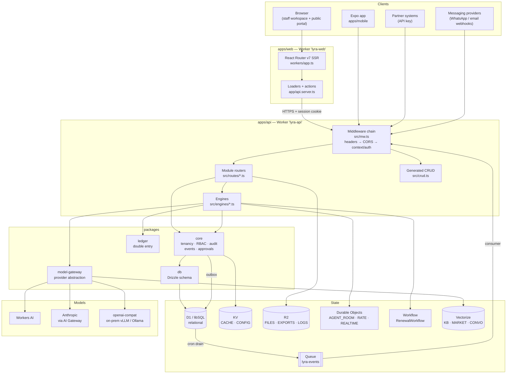

# 01 — System Overview

**Audience:** a support engineer who has never seen this code.
**Goal:** after reading this you should be able to take any user-visible symptom
and name the two or three files most likely responsible.

Describes commit `c7f1f57` on `main` (2026-08-18). Previous revision described
`8afd07d` (2026-08-13); [`README.md` §7](README.md#7-revision-history) lists what
changed in between, and which work is still on unmerged branches.

---

## 1. What LYRA is

LYRA is a **multi-tenant, whitelabel AI platform for financial-services
distribution** — aggregators, insurance brokers, banks and embedded partners. A
customer of LYRA is a *tenant*: a company that logs into their own branded
instance and runs their insurance distribution business inside it.

The product proposition, in plain terms: replace human minutes per transaction,
replace paid acquisition spend, and replace lagging management information —
with governed AI sitting on one shared data spine. "Governed" is the load-bearing
word: every AI action is attributed to a tenant, a module, a purpose and an
actor, is written to an audit log, and anything with financial or contractual
consequence needs a human approval.

The vision document is [`docs/00-vision.md`](../00-vision.md); the repository's
own summary is the root [`README.md`](../../README.md).

**One important fact for support:** the production deployment at
`lyra.vantax.co.za` currently carries **seeded demo data only** — a fictional
tenant called GONXT. It is a showcase, not a live book of business. The API
worker is deliberately configured with `ENVIRONMENT: "demo"`
([`apps/api/wrangler.jsonc`](../../apps/api/wrangler.jsonc)), which un-gates
one-click persona sign-in and a simulated clock. See
[`02-environments-and-access.md`](02-environments-and-access.md) §6 and
[`docs/25-go-live-checklist.md`](../25-go-live-checklist.md) §6 for the full
consequences.

## 2. The modules

LYRA is divided into **modules** — vertical slices of functionality. Each owns
its own API routes, its own screens, its own database tables (prefixed with the
module name), and its own events. There are five *product* modules and a set of
*cross-cutting* ones.

### 2.1 The five product modules

| Module | Pillar | What it actually does |
|---|---|---|
| **AXIS** | AI Operations | The back office. Quote-to-bind automation, case and claim lifecycles, document intelligence (extraction from PDFs and images), underwriting referrals, bordereaux, SLA monitoring, fraud scoring, reserve advice |
| **ORBIT** | AI Customer & Partners | The front office. Agentic customer conversations across channels (WhatsApp, email, web), renewal defence campaigns, partner/broker quote distribution, embedded-insurance partner APIs |
| **SIGNAL** | AI Marketing | Generative creative, audience and lifetime-value intelligence, SEO/AEO monitoring, campaign budgets and spend autopilot, suppression lists |
| **SCOUT** | AI Products | Whitespace detection (gaps in the product range), competitor panel and price intelligence, product experiments |
| **NORTH** | AI Insights | The executive layer. Narrated briefings, anomaly detection, simulations, board packs, KPI snapshots |

Each module is meant to demo, deploy and bill on its own — the shared core is
not a prerequisite purchase. Which modules a tenant has is an *entitlement*
(see §6).

### 2.2 The cross-cutting modules

These are not "AI pillars"; they are the machinery every tenant needs.

| Module | What it does | Where it lives |
|---|---|---|
| **distribution** (`dist` in code) | Partners, channels, commission entries and statements, clawbacks, next-best-offer | [`apps/api/src/routes/dist.ts`](../../apps/api/src/routes/dist.ts), [`apps/web/app/modules/distribution.ts`](../../apps/web/app/modules/distribution.ts) |
| **ledger** | Double-entry accounting. Transactions, journals, chart of accounts, trial balance, P&L, balance sheet, client-money segregation, period close, year end, reconciliation, settlements | [`packages/ledger/`](../../packages/ledger), [`apps/api/src/routes/ledger.ts`](../../apps/api/src/routes/ledger.ts) |
| **analytics** | Reports, dashboards, scheduled exports | [`apps/api/src/routes/analytics.ts`](../../apps/api/src/routes/analytics.ts) |
| **compliance** | Consent, data-subject requests, conduct checks, compliance runs | [`apps/api/src/routes/compliance.ts`](../../apps/api/src/routes/compliance.ts), [`packages/core/src/consent.ts`](../../packages/core/src/consent.ts) |
| **admin** | Per-tenant administration: staff, roles and permissions, security posture, developer console, AI console and budget | [`apps/web/app/modules/admin.ts`](../../apps/web/app/modules/admin.ts), [`apps/api/src/routes/staff.ts`](../../apps/api/src/routes/staff.ts) |
| **platform** | Cross-tenant administration for the LYRA operator (not the tenant): tenant provisioning, event dead-letter replay, cost explorer | [`apps/api/src/routes/platform.ts`](../../apps/api/src/routes/platform.ts), [`apps/web/app/routes/platform.tsx`](../../apps/web/app/routes/platform.tsx) |
| **settings** | Tenant self-service configuration: brand, locales, autonomy policy, domain pack | [`apps/web/app/routes/settings.tsx`](../../apps/web/app/routes/settings.tsx) |

The canonical machine-readable list of event-emitting modules is `MODULES` in
[`packages/core/src/events.ts`](../../packages/core/src/events.ts):
`core, dist, axis, orbit, signal, scout, north, ledger, ai, compliance,
analytics, platform`.

The canonical list of *workspaces* (the left-hand navigation rail in the web UI)
is `WORKSPACES` in
[`apps/web/app/modules/index.ts`](../../apps/web/app/modules/index.ts):
`axis, orbit, signal, scout, north, distribution, ledger, analytics, compliance,
admin` — in that rail order.

## 3. Repository layout

Monorepo. **pnpm workspaces + turbo**, Node 22, TypeScript strict. The pnpm
version is pinned by `packageManager` in [`package.json`](../../package.json) —
use `corepack enable`, not a global install.

```
/apps
  /api      Hono on Cloudflare Workers — the API. Every module router, the
            Durable Objects, the Workflow, the cron handler.
  /web      React Router v7 (framework mode) on Workers — all web UI.
  /mobile   Expo (SDK 55) + expo-router. A thin read-mostly client.
/packages
  /core     Domain logic shared by every module: tenancy, RBAC, audit, events,
            approvals, consent, PII handling, the seed fixture.
  /db       Drizzle schema + forward-only migrations. SQLite dialect only.
  /ledger   Double-entry ledger, transaction state machines, financial reports.
  /model-gateway  LLM provider abstraction + the eval suite.
  /ui       "Constellation" design system (React + Tailwind v4).
  /sdk      Typed client SDK generated from OpenAPI + webhook helpers.
  /config   Shared eslint and tsconfig.
/ops        On-prem Docker stack: compose file, Dockerfile, Caddyfile.
/infra
  /cloudflare  Terraform for zone/account settings wrangler does not cover.
/e2e        Playwright journey specs and their fixture setup.
/scripts    The `lyra` operator CLI (on-prem init/migrate/seed/smoke,
            staging smoke).
/docs       The specification pack. Source of truth for intended behaviour.
```

### 3.1 Layout divergences from the specification — read this

[`CLAUDE.md`](../../CLAUDE.md) and [`docs/02-architecture.md`](../02-architecture.md)
describe a *target* layout that the code has not fully reached. If you go
looking for these paths you will not find them:

| Spec says | Reality | Notes |
|---|---|---|
| `apps/agents` (Durable Objects + Workflows) | Does not exist. Lives in [`apps/api/src/engines/`](../../apps/api/src/engines) | `agent-room.ts`, `rate-counter.ts`, `user-channel.ts`, `renewal-workflow.ts` |
| ~~`infra/onprem/docker-compose.yml`~~ | [`ops/docker-compose.yml`](../../ops/docker-compose.yml) | **Resolved 2026-08-27** — CLAUDE.md and docs/11 corrected to `ops/`, per ADR-0010 |
| `apps/api/src/modules/<m>` | [`apps/api/src/routes/`](../../apps/api/src/routes) — one file per module | Plus generated CRUD, see §4.3 |
| `packages/core/tools`, `packages/core/seams`, `packages/core/rooms` | Flat files: [`packages/core/src/seams.ts`](../../packages/core/src/seams.ts); tools in [`apps/api/src/engines/orbit-tools.ts`](../../apps/api/src/engines/orbit-tools.ts) | |
| `withTenant(db, tenantId)` | **Does not exist.** The real helpers are `scoped(ctx, table)` and `assertTenant(...)` in [`packages/core/src/context.ts`](../../packages/core/src/context.ts) | See §6. This is the single most common source of confusion when reading `CLAUDE.md` against the code |

Also note that `pnpm lint` currently fails in every package — ESLint 9 resolves
its flat config from the invoking package and only `packages/config` has one.
This is a known gap recorded in the root [`README.md`](../../README.md), not a
broken checkout.

## 4. Component diagram and the request path

### 4.1 The picture



### 4.2 Browser to data, step by step

1. **The browser hits `lyra.vantax.co.za`.** That hostname is a Cloudflare
   custom domain routed to the `lyra-web` Worker
   ([`apps/web/wrangler.jsonc`](../../apps/web/wrangler.jsonc)).
2. **`lyra-web` server-renders.** The Worker entry point is
   [`apps/web/workers/app.ts`](../../apps/web/workers/app.ts) — a very thin file
   that hands `(request, env, ctx)` to React Router's request handler. Routing is
   declared in [`apps/web/app/routes.ts`](../../apps/web/app/routes.ts).
3. **A loader or action calls the API.** The *only* way `apps/web` talks to the
   API is [`apps/web/app/api.server.ts`](../../apps/web/app/api.server.ts). The
   `.server` suffix makes a client-side import a build error, which is
   deliberate: the session cookie never has to be script-readable and the API
   origin never reaches the client bundle. The API origin comes from the
   `API_ORIGIN` var in the wrangler config.
4. **`lyra-api` receives the request.** One Worker, one Hono router
   ([`apps/api/src/index.ts`](../../apps/api/src/index.ts)). Middleware runs in
   this order (see [`apps/api/src/mw.ts`](../../apps/api/src/mw.ts)):
   - `withHeaders` — security headers on every response, including errors
   - `withCors`
   - `withContext` — the important one. Unless the path is on the public
     allowlist (`/health`, `/openapi.json`, the auth routes, SSO callbacks,
     `/v1/portal/*`, `/v1/channels/*`), it authenticates the session cookie,
     builds the per-request `Ctx` (tenant, actor, permissions, request id,
     clock), and attaches a model-gateway instance.
5. **A route handler runs.** Hand-written module routers mount at
   `/v1/<module>` *before* the generated CRUD, so a hand-written path always
   wins the match. Business logic that is more than a read lives in
   [`apps/api/src/engines/`](../../apps/api/src/engines).
6. **Data access goes through Drizzle.** Schema in
   [`packages/db/src/schema/`](../../packages/db/src/schema), queries scoped by
   `scoped(ctx, table)` from
   [`packages/core/src/context.ts`](../../packages/core/src/context.ts). In the
   cloud the underlying store is **D1**; on-prem it is **libSQL**. Same schema,
   same Drizzle dialect, same migrations — that is the "one schema, two homes"
   rule.
7. **The response comes back**, the loader renders, the HTML streams to the
   browser.

Two routes are reachable without any credentials and are the first things to
check when something looks down: `GET /health` and `GET /openapi.json`.

### 4.3 Generated CRUD vs hand-written routes

Most of a workspace is lists and records. Rather than write a route per
resource, LYRA declares resources once and generates the CRUD:

- **API side:** `mountAll` in [`apps/api/src/crud.ts`](../../apps/api/src/crud.ts)
  mounts generated list/read/create/update/delete under `/v1/<module>/<resource>`.
- **Web side:** each workspace is a *spec* file in
  [`apps/web/app/modules/`](../../apps/web/app/modules) (one per workspace,
  typed by [`spec.ts`](../../apps/web/app/modules/spec.ts)). The spec declares
  tabs, columns, filters, forms, actions and the RBAC permission each needs. Two
  generic React Router routes render every one of them.

**Practical consequence for support:** if a user says "the list on the ORBIT
conversations tab is missing a column" or "I can see a button I should not be
allowed to press", the answer is almost always in the module's spec file, not in
a page component. Screens that are genuinely their own thing (quote comparison,
trial balance, the approvals queue) do get their own file in
[`apps/web/app/routes/`](../../apps/web/app/routes).

### 4.4 One shell per module (ADR-0061)

Between the first edition of this pack and this one, the single shared
application shell was **forked into one shell per product module**. Each module
now has its own layout route, and its own routes are declared as children of it:

| Module | Shell route |
|---|---|
| AXIS | [`axis-shell.tsx`](../../apps/web/app/routes/axis-shell.tsx) |
| ORBIT | [`orbit-shell.tsx`](../../apps/web/app/routes/orbit-shell.tsx) |
| SIGNAL | [`signal-shell.tsx`](../../apps/web/app/routes/signal-shell.tsx) |
| SCOUT | [`scout-shell.tsx`](../../apps/web/app/routes/scout-shell.tsx) |
| NORTH | [`north-shell.tsx`](../../apps/web/app/routes/north-shell.tsx) |

Each shell loads its own module's session data through a per-module hook rather
than the previously shared `useShellData`. The reasoning is in
[ADR-0061](../decisions/ADR-0061-shell-per-module.md); the practical effects for
support are:

- **A blank or broken module is now a one-module fault.** Read that module's
  shell route first. Before the fork, one shell error took every module down
  together — a useful diagnostic signal that no longer exists.
- **Chrome can legitimately differ between modules.** If a user says "the rail
  looks different in SCOUT than in AXIS", that is possible by design now. It is
  only a defect if the difference breaks a documented behaviour.
- **A fix to one module's shell does not fix the others.** When you escalate a
  shell bug, name the module.

There is now a **module switcher**, which is a change from the first edition of
this pack. Each shell's rail lists only its own module's screens, so the rail is
no longer one shared list of everywhere the actor can go. The switcher is the
only way to reach a different shell's rail, and it renders **only when the
actor's roles resolve to more than one module shell** — the shell you are
already in is not a destination, and the shared workspaces (ledger, admin,
distribution, settings, platform) have no shell of their own to switch to.

[ADR-0052](../decisions/ADR-0052-no-module-switcher-the-rail-is-one.md) is
**narrowed, not reversed**, by ADR-0061 §"ADR-0052 narrowing": no redundant
second control *within* one shell, which still holds; choosing *between* shells
is not that case. If a user with one module's roles reports "the module
switcher is missing", that is correct behaviour, not a defect.

## 5. The event bus

Modules do not import each other. They integrate by publishing events. Direct
cross-module imports are forbidden except from `packages/core`.

The implementation is a **transactional outbox**, in
[`packages/core/src/events.ts`](../../packages/core/src/events.ts):

1. `emit(ctx, {module, type, subject, data})` writes an event row **inside the
   same database transaction as the state change it describes**. That is the
   whole point — you cannot end up with a policy issued and no
   `axis.case.issued` event, or the reverse.
2. The **cron trigger** (every 5 minutes in production, every 15 in staging —
   see `triggers.crons` in
   [`apps/api/wrangler.jsonc`](../../apps/api/wrangler.jsonc)) drains pending
   outbox rows and publishes them to the Cloudflare Queue `lyra-events`.
3. The **queue consumer** is the same Worker. It calls `consume(...)`, which
   de-duplicates on event id against an inbox table before doing any work, so
   consumers are idempotent by construction.
4. Messages that keep failing go to a **dead-letter** state after
   `MAX_ATTEMPTS` (5, in [`events.ts`](../../packages/core/src/events.ts)).
   `consume(...)` returns one of `processed | duplicate | retry | dead`, and
   dead rows are replayable via `replayDlq(...)` and the Platform Admin surface.

The envelope is fixed and versioned:

```
{ id, ts, tenant_id, module, type, actor, subject?, data, v: 1 }
```

`type` is dotted and module-prefixed, e.g. `axis.case.issued`. On-prem the same
outbox drains on an interval instead of a cron trigger (`MODE=jobs`,
`CRON_INTERVAL_MS`).

**For support:** "the downstream thing did not happen" is usually an event
problem, and the diagnosis order is: did the outbox row get written → did the
drain run → did the consumer succeed → is it in the DLQ.

## 6. Multi-tenancy

This is the rule that everything else is built on, and the rule you must never
weaken to make something work.

- **Every tenant-owned table carries a `tenant_id` column.** The schema is in
  [`packages/db/src/schema/`](../../packages/db/src/schema); the invariant is
  tested in [`packages/db/src/tenancy.test.ts`](../../packages/db/src/tenancy.test.ts).
- **Every query is scoped through `packages/core`.** The real helpers, despite
  what `CLAUDE.md` says about `withTenant`, are in
  [`packages/core/src/context.ts`](../../packages/core/src/context.ts):
  - `scoped(ctx, table, ...extra)` — builds a `WHERE tenant_id = ctx.tenantId
    AND …` clause, also filtering soft-deleted rows
  - `scopedWithDeleted(ctx, table, ...extra)` — same without the soft-delete filter
  - `assertTenant(ctx, row, resource)` — throws a **404** (not a 403) when a row
    belongs to another tenant. Returning "not found" rather than "forbidden" is
    deliberate: a 403 confirms the record exists
- **The `Ctx` object is the per-request identity.** It carries `tenantId`, the
  actor, the resolved permissions, a request id, and the clock. It is built once
  in `withContext` and threaded through everything.
- **Roles and permissions** are per-tenant rows, not code constants. Role keys
  look like `tenant.admin`, `axis.agent`, `finance.controller`,
  `north.exec`. The RBAC evaluation, including team-scoped grants, is in
  [`packages/core/src/rbac.ts`](../../packages/core/src/rbac.ts).
- **Entitlements** decide which modules and features a tenant has, plus seat
  counts and AI budget: [`packages/core/src/entitlements.ts`](../../packages/core/src/entitlements.ts).
  The API enforces them; the UI reads the same object to hide or disable things,
  so a user seeing a module they did not buy is an entitlements bug, not a UI bug.
- **Cross-tenant isolation is a CI gate**, not a convention. An attempted
  cross-tenant read must fail.

Two related conventions you will meet in tickets:

- **Brand tokens, not brand strings.** Name, logo and colours come from tenant
  config; see `productName` resolution in
  [`apps/web/app/components/shell.tsx`](../../apps/web/app/components/shell.tsx).
  A hard-coded "LYRA" on a user-facing surface is a defect.
- **Domain packs.** Industry nouns ("policy", "premium", "insurer") are *not*
  hard-coded — they resolve from the tenant's active domain pack via
  [`apps/web/app/modules/vocabulary.ts`](../../apps/web/app/modules/vocabulary.ts).
  The default pack is `insurance-retail`; `retail-ecom` ships as the proving
  pack. So "the label says the wrong word" may be a domain-pack question.

## 7. The model gateway

**No application code may call an LLM provider SDK directly.** Everything goes
through [`packages/model-gateway/`](../../packages/model-gateway).

- **One entry point.** The `Gateway` class in
  [`packages/model-gateway/src/gateway.ts`](../../packages/model-gateway/src/gateway.ts),
  attached to every request by the API's `withContext` middleware. Every call
  carries tenant, module, purpose and actor, and is written to the AI audit log.
- **Three providers**, in
  [`packages/model-gateway/src/providers/`](../../packages/model-gateway/src/providers):
  - `workers-ai` — Cloudflare Workers AI. The default for every tier until a
    tenant overrides it
  - `anthropic` — Claude, routed through Cloudflare AI Gateway when
    `AI_GATEWAY_URL` is set
  - `openai-compat` — an OpenAI-compatible endpoint; this is how the on-prem
    twin reaches its internal vLLM or Ollama service, with no code change
  - plus `stub` for tests
- **Tiers**, not model names, in application code: `TIERS = ["fast",
  "standard", "reasoning"]` in
  [`types.ts`](../../packages/model-gateway/src/types.ts), mapped to concrete
  models per provider in
  [`models.ts`](../../packages/model-gateway/src/models.ts). Tenant policy maps
  tier to provider, which is how an on-prem tenant sends every tier to its
  internal model without a code change.
- **Guardrails** run before and after every call:
  [`guardrails.ts`](../../packages/model-gateway/src/guardrails.ts) and
  [`scrub.ts`](../../packages/model-gateway/src/scrub.ts). `scrub.ts` redacts
  Cloudflare/Anthropic/OpenAI/AWS tokens, bearer tokens, private keys and JWTs
  *before* a message reaches the provider or the request hash, flagging
  `secret_in_prompt` separately from `pii`.
- **Budget** is enforced per tenant per day by
  [`budget.ts`](../../packages/model-gateway/src/budget.ts) — a D1 row, warning
  at 80% (`WARN_AT`) and hard-stopping at 100%. Note this is *not* a Durable
  Object, despite the specification; that was a deliberate decision recorded in
  [`ADR-0021`](../decisions/ADR-0021-budget-counter-do-deferred.md).
- **A kill switch** exists: [`kill.ts`](../../packages/model-gateway/src/kill.ts).
- **AI features are eval-first.** Golden sets and thresholds live in
  [`packages/model-gateway/evals/`](../../packages/model-gateway/evals) — one
  directory per capability (`axis-fnol-triage`, `axis-fraud`, `axis-vision`,
  `orbit-draft`, `injection`, `cx-quality`, and more). `pnpm eval` runs them,
  and CI gates on them. If someone asks you to "just tweak the prompt", the
  answer is that a prompt change which does not move a measured eval is a
  refactor and must not change eval output.

**Human-in-the-loop.** Any action tagged `consequential: true` — pricing, claims
guidance, regulated advice, outbound send, payment — requires an approval step
unless the tenant has explicitly automated that action type. The approvals
machinery is [`packages/core/src/approvals.ts`](../../packages/core/src/approvals.ts)
with the queue at [`apps/web/app/routes/approvals.tsx`](../../apps/web/app/routes/approvals.tsx).

## 8. Money: the ledger

Anything that changes money or contractual state is a **transaction** with an
idempotency key, a state machine, approvals, and — if financial — balanced
double-entry journal lines. Nothing writes money-affecting state directly.

[`packages/ledger/`](../../packages/ledger) contains the posting engine
([`posting.ts`](../../packages/ledger/src/posting.ts)), the transaction state
machine ([`txn.ts`](../../packages/ledger/src/txn.ts)), preconditions,
recipes, period close ([`periods.ts`](../../packages/ledger/src/periods.ts)),
reconciliation, and the financial reports.

Ledger invariants are property-tested and **may not be relaxed to make a test
pass**. Client money is segregated as a first-class concept
(`clientMoney` on accounts). Money out is dual-control — which is why the seed
fixture deliberately contains *two* finance controllers.

### 8.1 The revenue lines

The platform earns in more than one way, and each way is a **transaction type**
in the registry ([`types.ts`](../../packages/ledger/src/types.ts)) with a
**recipe** ([`recipes.ts`](../../packages/ledger/src/recipes.ts)) naming the
accounts it posts to. Nothing books money without one. The lines live on `main`
as of this revision:

| Type | Financial? | Income | Receivable | Earned when |
|---|---|---|---|---|
| `BIND` / `BIND-GROUP` | yes | `4000` | default | a policy or a group scheme binds |
| `FEE-BROK` | yes | `4020` | `1160` | a broker fee is charged on a policy |
| `REFERRAL-QUAL` | no | — | — | a referral qualifies (evidence only, no posting) |
| `REFERRAL-SETL` | yes | `4030` | `1160` | a qualified referral settles |
| `AD-PLACEMENT` | yes | `4070` | `1160` | a paid placement runs |
| `PARTNER-BIND` | yes | `4075` | default | a distribution partner binds through the API |
| `FIN-CMSN` | yes | `4080` | `1150` | a premium-financing plan is opened |
| `DISCLOSURE-PRESENT` | no | — | — | a required disclosure is shown (evidence only) |
| `TELEM-INGEST` | no | — | — | a batch of usage/sensor readings is stored (evidence only) |
| `UBI-REPRICE` | yes | `4000` | default | telemetry moves a contract's price mid-term |

Two of these have behaviour that generates support tickets:

- **`AD-PLACEMENT` refuses to post without a fresh disclosure.** The
  `freshAdPlacementDisclosure` precondition in
  [`preconditions.ts`](../../packages/ledger/src/preconditions.ts) blocks it. A
  refused placement is nearly always a missing `DISCLOSURE-PRESENT`, not a
  ledger fault.
- **Commission is flat-rate only.** No tiered or sliding scales exist anywhere
  in the recipes (file 08 §2.4). "The commission is wrong" is far more often
  "the rate the tenant expected is not the rate configured".

`FIN-CMSN` has a recipe on `main` but nothing calls it yet — the engine that
opens financing plans is on an unmerged branch. See
[`README.md` §7](README.md#7-revision-history).

`TELEM-INGEST` and `UBI-REPRICE` are likewise unmerged. Two things about the
pair are worth knowing before the first support call:

- **`UBI-REPRICE` posts exactly what `ENDORSE` posts.** The recipes are
  deliberately identical; the two codes differ in *provenance*, not in money. A
  reprice tells you a sensor moved the price rather than an underwriter, which
  is the first question when a customer disputes a premium. Reporting grouped by
  transaction type sees them apart; reporting grouped by account does not.
- **A price cannot move more than 25% in one reprice.** The clamp lives in the
  model gateway (`MAX_REPRICE_PPM`), before any engine sees the reply, and a
  proposed factor with no evidence is dropped rather than priced. "The model
  wanted +40%" is a clamped reprice, not a fault.

See [ADR-0065](../decisions/ADR-0065-timeseries-ingest-is-load-bearing.md).

## 9. Two homes: Cloudflare and on-prem

The same code runs in two places. Nothing below
[`apps/api/src/env.ts`](../../apps/api/src/env.ts) knows which.

| Concern | Cloudflare (primary) | On-prem (`RUNTIME=node`) |
|---|---|---|
| HTTP runtime | Workers (`workerd`) | Node 22 via [`apps/api/src/node.ts`](../../apps/api/src/node.ts) |
| Relational store | D1 | libSQL (`ghcr.io/tursodatabase/libsql-server`) |
| Object store | R2 (`FILES`, `EXPORTS`, `LOGS`) | Shared volume at `FILES_DIR` (MinIO is in the stack but not yet wired) |
| Key-value | KV (`CACHE`, `CONFIG`) | In-process `Map` (Redis is in the stack but not yet wired) |
| Queues | Cloudflare Queues (`lyra-events`) | Same outbox, drained by `MODE=jobs` on `CRON_INTERVAL_MS` |
| Scheduled work | Cron trigger | `MODE=jobs` running the same `scheduled` handler |
| Models | Workers AI / Anthropic via AI Gateway | Internal vLLM or Ollama via `openai-compat` |
| Vectors | Vectorize | Qdrant (in the stack, not yet wired) |
| TLS / ingress | Cloudflare | Caddy — the only service that publishes a port |

The on-prem stack is [`ops/docker-compose.yml`](../../ops/docker-compose.yml),
built from [`ops/Dockerfile`](../../ops/Dockerfile), fronted by
[`ops/Caddyfile`](../../ops/Caddyfile). Optional profiles: `--profile gpu` swaps
Ollama for vLLM, `--profile observability` adds a bundled OTEL/Grafana stack.

**On-prem status at handover** (from the root [`README.md`](../../README.md)):
`app` and `worker` genuinely run on Node and serve the same Hono router. Not yet
wired to the twin: `redis`, `minio`, `qdrant` and `render` — each is a stack
service with no caller in `apps/api` today. Because the KV stand-in is
per-container, **run one `app` replica** until Redis is wired, or the login
throttle counts per replica instead of per estate. The `ponytail:` comments in
[`apps/api/src/node.ts`](../../apps/api/src/node.ts) mark each of these
deliberately.

## 10. Extension seams

[`docs/16-future-horizons.md`](../16-future-horizons.md) reserves a set of
interfaces for capabilities not yet built — `Channel`, `SpeechProvider`,
`IdentityVerifier`, `DataInConnector`, `TimeseriesIngest`, `AutonomyEnvelope`.
They live in [`packages/core/src/seams.ts`](../../packages/core/src/seams.ts)
and are treated as internal public API: versioned, documented, never bypassed.

Why support cares: the `Channel` seam is why WhatsApp, email and web
conversations all funnel through the same ORBIT code
([`apps/api/src/engines/orbit-channel-adapters.ts`](../../apps/api/src/engines/orbit-channel-adapters.ts)).
When a user reports "WhatsApp messages are not arriving", the adapter is the
first place to look, and the shared inbound path
([`orbit-channel-inbound.ts`](../../apps/api/src/engines/orbit-channel-inbound.ts))
is the second.

## 11. Where to start reading, by symptom

| Symptom | Start here |
|---|---|
| Cannot log in | [`apps/api/src/auth.ts`](../../apps/api/src/auth.ts), then [`apps/web/app/routes/login.tsx`](../../apps/web/app/routes/login.tsx) |
| "Not permitted" / missing menu item | [`packages/core/src/rbac.ts`](../../packages/core/src/rbac.ts), then the workspace spec in [`apps/web/app/modules/`](../../apps/web/app/modules) |
| Whole module missing for a tenant | [`packages/core/src/entitlements.ts`](../../packages/core/src/entitlements.ts) |
| One module blank or its chrome broken, others fine | That module's shell route — `<module>-shell.tsx` in [`apps/web/app/routes/`](../../apps/web/app/routes) (§4.4) |
| Commission booked but the wrong amount, or not booked at all | The line's recipe in [`packages/ledger/src/recipes.ts`](../../packages/ledger/src/recipes.ts) and its precondition in [`preconditions.ts`](../../packages/ledger/src/preconditions.ts) (§8.1) |
| A list is empty that should not be | Tenancy scoping — `scoped()` in [`packages/core/src/context.ts`](../../packages/core/src/context.ts) — and the RBAC team-scope on the user's grant |
| AI answer is wrong, slow, or refused | [`packages/model-gateway/src/gateway.ts`](../../packages/model-gateway/src/gateway.ts), the AI audit log, and the relevant eval under [`packages/model-gateway/evals/`](../../packages/model-gateway/evals) |
| AI stopped working entirely mid-day | Budget hard stop: [`packages/model-gateway/src/budget.ts`](../../packages/model-gateway/src/budget.ts) |
| Something downstream never happened | Event outbox and DLQ: [`packages/core/src/events.ts`](../../packages/core/src/events.ts) |
| Numbers do not balance | [`packages/ledger/src/posting.ts`](../../packages/ledger/src/posting.ts) and the trial balance report |
| Wrong word / wrong language on screen | [`apps/web/app/i18n/`](../../apps/web/app/i18n) and [`apps/web/app/modules/vocabulary.ts`](../../apps/web/app/modules/vocabulary.ts) |
| Document extraction produced nonsense | [`apps/api/src/engines/axis-document-render.ts`](../../apps/api/src/engines/axis-document-render.ts) and [`packages/model-gateway/src/extract.ts`](../../packages/model-gateway/src/extract.ts) |
| Site down | `GET /health` on both hosts, then Cloudflare dashboard — see [`03-operations-runbook.md`](03-operations-runbook.md) |

---

**Next:** [`02-environments-and-access.md`](02-environments-and-access.md) — how
to run and reach each environment.
